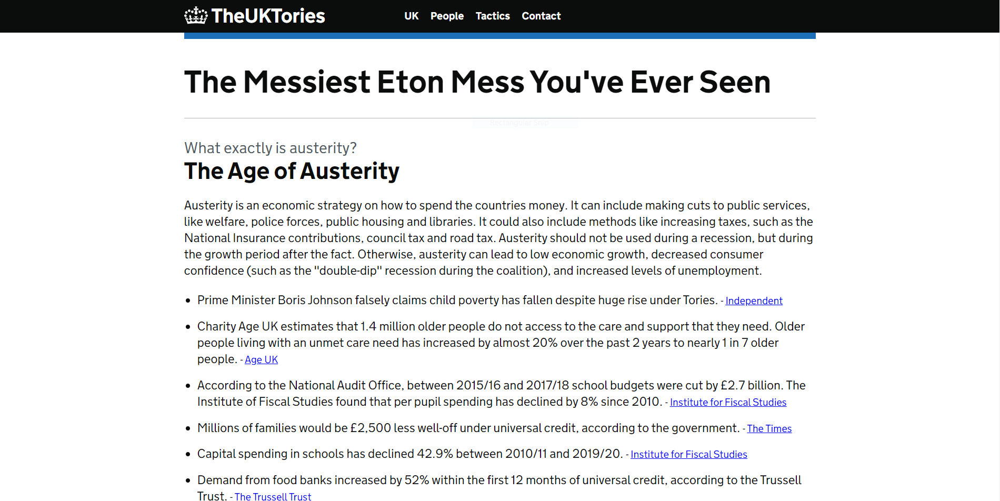
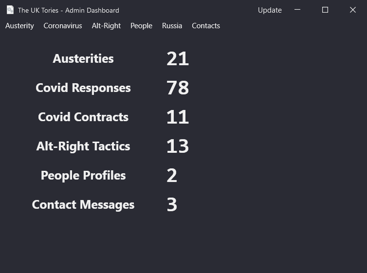

Epics 

Tasks 

# Projects
## TheUKTories
The main frontend application to view data, the public website.
- ASP.NET / .NET 5 Razor Pages Web Application
- [GOV.UK Frontend Design System](https://design-system.service.gov.uk/) by UK Government Digital Services
- [GovUk.Frontend.AspNetCore](https://github.com/gunndabad/govuk-frontend-aspnetcore) by gunnadabad
## TheUKTories.DataStores
Data access layer and business objects. Used by the webapp and Dashboard.
- .NET 5 Class Library
- Microsoft.Azure.Cosmos - Cosmos connectivity - without fat-ass EntityFrameworkCore
- Newtonsoft.Json - because I'm too lazy to port to System.Text.Json
## TheUKTories.Dashboard
Administrative access to the data without having to have to fire up the Azure Data Explorer and manually edit json...
- [AdonisUI and AdonisUI.ClassicTheme](https://github.com/benruehl/adonis-ui) by benruehl - A really cool library that brings a plugin dark theme for WPF
- Microsoft.Extensions.Hosting - For when I finally get around to implementing .NET 5 based dependency injection and IoC

__How do I add more data?__
1) Add a model with json related attributes in the `TheUKTories.DataStores.AzureCosmos.Models` directory.
2) Add a public `Container` object to `CosmosDbContext`, config in init
